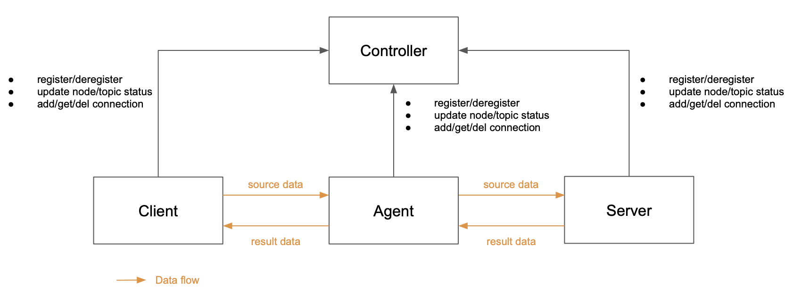
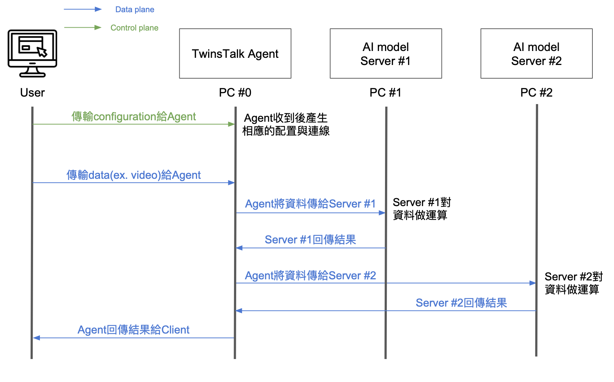
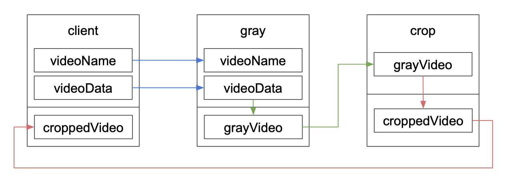

# HSCC - TwinsTalk

## Architecture

### Overall

在TwinsTalk中，所有Client、Agent、Server都視為一群node，這些node會向Controller註冊、解註冊、更新狀態、增刪連線等等⋯。實際資料將在node與node之間傳遞。



### Interaction between Client and Server

User上傳的資料會透過Agent在各個Server之間傳遞，最終將結果回傳給Client。



> 執行以下步驟前，請先至`config.py`更改controller與agent IP & Port

## Configuration file

Configuration file為使用者定義的資料傳輸流程，以JSON格式撰寫。以下為規則描述：

* `client_name`: 不含底線，以`Client`字串結尾
* `service`: 自定義服務名稱
* `input`: 串列，每個元素為輸入的資料名稱與型態
    * `topic_name`: topic名稱，必須跟server端的topic一致
    * `data_type`: topic資料型態，必須跟server端的topic一致
* `output`: 串列，每個元素為輸出的資料名稱與型態
* `node`: 串列，每個元素包含服務名稱、I/O的資料名稱與型態
    * `calculator`: 使用的服務名稱
    * `input`: 串列，該服務所接受的資料名稱與型態
    * `output`: 串列，該服務輸出的資料名稱與型態

以**simeple_demo**的configuration file為例，使用者對TwinsTalk Agent傳輸**影片檔**與**檔名**，會得到**灰階+縮小比例**的影片輸出。
使用者分別對`videoName`和`videoData`兩項topic上傳檔名與影片，其中`videoName`和`videoData`必須與gray的input格式對應，如圖中藍線；gray會產出灰階影片`grayVideo`，再與crop的input格式對應，如圖中綠線；crop會產生`croppedVideo`，最後與client的output格式對應，如圖中紅線。



下方為**simple_demo**的configuration file。

* `input`定義Client上傳資料的topic，此處將上傳bytes型態的影片至**videoData**，以及str型態的檔名至**videoName**。
* `output`定義Client收到結果的topic，此處將從**croppedVideo**收到bytes型態的影片。
* `node`定義資料處理所需的service，先利用gray做灰階化，再將灰階的結果傳至crop調整大小。


```json
{
    "client_name": "01.demoClient",         
    "service": "simple_demo",               
    "input": [
        {
            "topic_name": "videoName",
            "data_type": "str"
        },
        {
            "topic_name": "videoData",
            "data_type": "bytes"
        }
    ],
    "output": [
        {
            "topic_name": "croppedVideo",
            "data_type": "bytes"
        }
    ],
    "node":[
        {
            "calculator": "gray",
            "input": [
                {
                    "topic_name": "videoName",
                    "data_type": "str"
                },
                {
                    "topic_name": "videoData",
                    "data_type": "bytes"
                }
            ],
            "output": [
                {
                    "topic_name": "grayVideo",
                    "data_type": "bytes"
                }
            ]
        },
        {
            "calculator": "crop",
            "input": [
                {
                    "topic_name": "grayVideo",
                    "data_type": "bytes"
                }
            ],
            "output": [
                {
                    "topic_name": "croppedVideo",
                    "data_type": "bytes"
                }
            ]
        }
    ]
}
```

## How to use this system on client side?

以下步驟為Client使用TwinsTalk的流程與sample code。

1. 定義**Configuration file**
2. 檢查所需要的service是否已啟動
3. 撰寫Client端的程式碼，以下為程式流程：
    * 引用`TwinsTalk_Client`類別
    * 讀取**configuration file**
    * 將**configuration**傳入`TwinsTalk_Client`，並呼叫函式`run`，啟動client
    * 撰寫pub程式，對topic寫入資料
    * 撰寫sub程式，從topic讀出結果
    * 結束client
4. 執行程式，`python PATH/TO/FILE.py`

```python
import sys
sys.path.append("..")

from twinstalk_api.twinstalk_client import TwinsTalk_Client
import json

def main():
    with open("gray_and_crop.json") as f:
        configuration = json.load(f)

    tt_client = TwinsTalk_Client(configuration)
    tt_client.run()

    file = open("input_video.mp4", "rb")
    data = file.read()

    tt_client.pub.data_writer('videoName', "input_video.mp4")
    tt_client.pub.data_writer('videoData', data)

    output_file = "cropped_video.mp4"

    while True:
        tt_client.sub.updata_data()
        proto = tt_client.sub.read_topic('croppedVideo')
        if proto is not None:
            with open(output_file, "wb") as f:
                f.write(proto.data)
            break
    
    tt_client.terminate()


if __name__ == '__main__':
    main()

```

## How to use this system on server side?

以下步驟為在TwinsTalk上註冊服務的流程以及sample code。(以gray為例)

1. 引用`TwinsTalk_Server`類別及`config`資訊(IP & Port)。
2. 定義該服務的`IP`、`PUB_PORT`、`SUB_PORT`
3. 在**pub_config -> node_config -> node_id**中為服務的pub命名，須以`pub/server/`開頭。
4. 在**sub_config -> node_config -> node_id**中為服務的sub命名，須以`sub/server/`開頭。
5. 在**sub_config -> topic_config -> topic_info**中定義服務輸出的topic名稱與資料型態。(不含底線，使用Camel-Case)
6. 在**pub_config -> topic_config -> topic_info**中定義服務接受的topic名稱與資料型態。(不含底線，使用Camel-Case)
7. 在`myfunc`函式中，撰寫服務的程式碼。該函式會接收參數`client_data`，參數為dictionary，包含sub topic接收的資料，利用`client_data["videoName"]`即可存取。
8. return的資料型態為dictionary，須包含**所有**pub topic需要的資料。
9. 執行程式，`python PATH/TO/FILE.py`

```python
import sys
sys.path.append("..")

from twinstalk_api.twinstalk_server import TwinsTalk_Server
from pub_sub_app import node_api2 as node_api
from pub_sub_app import Publisher2 as Publisher
from config import CONTROLLER_IP, CONTROLLER_PORT, AGENT_IP
import time

from services.gray import gray

SERVER_IP = "140.113.28.158"
PUB_PORT = 12345
SUB_PORT = 12346

pub_config = {
    "node_config": {
        "server_ip": CONTROLLER_IP,
        "server_port": CONTROLLER_PORT,
        "node_id": "pub/server/gray",
        "node_name": "pub/server/gray",
        "node_domain": "domain1"
    },
    "topic_config": {
        "mode": 1,
        "ip": SERVER_IP,
        "port": PUB_PORT,
        "topic_info": {
            "grayVideo": "bytes"
        }
    }
}

sub_config = {
    "node_config": {
        "server_ip": CONTROLLER_IP,
        "server_port": CONTROLLER_PORT,
        "node_id": "sub/server/gray",
        "node_name": "sub/server/gray",
        "node_domain": "domain1"
    },
    "topic_config": {
        "mode": 0,
        "ip": SERVER_IP,
        "port": SUB_PORT,
        "topic_info": {
            "videoName": "str",
            "videoData": "bytes",
        }
    }
}

config = {
    "pub_config": pub_config,
    "sub_config": sub_config
}


# User defined fuction
# The return value must contain all of the pub_topic's data
def myfunc(client_data):
    '''
    Args: 
        client_data: A dictionary that keeps the data of sub_topic
                    use client_data["topic_name"] to access data
    Returns:
        result_data: A dictionary that keeps the data of pub_topic
    '''
    
    video_name = client_data["videoName"]
    video_data = client_data["videoData"]
    
    print(f"[INFO] gray_server got videoName={video_name} & videoData size = {sys.getsizeof(video_data)}", )

    gray_video = gray(video_name, video_data)

    result_data = {
        "grayVideo": gray_video
    }

    return result_data

if __name__ == '__main__':
    tt_server = TwinsTalk_Server(config, myfunc)
    tt_server.run()
```

## How to run Agent?

Agent作為TwinsTalk系統的核心，負責接收Client傳輸的資料，依照Client制定的configuration轉傳資料到各個服務，並將最終結果回傳給Client，執行以下指令啟動Agent：

```
cd agent
python main.py
```

## How to run controller?

Controller負責管理TwinsTalk上所有node的運作狀況，同時做為資料庫存取的介面，提供各種gRPC function讓node得以在TwinsTalk上註冊、更新狀態、取得連線資訊，執行以下指令啟動Controller：

```
cd pub_sub_platform
python controller.py
```

## How to run web interface?

TwinsTalk提供簡易的Web UI供使用者查看目前的node、topic、connection資訊。執行以下指令啟動UI：

```
cd pub_sub_platform
python web_ui.py
```

---

## Simple demo steps:

1. 至`config.py`更改:
```
...

CONTROLLER_IP = "YOUR_IP"
CONTROLLER_PORT = "YOUR_PORT"
AGENT_IP = "YOUR_IP

...
```

2. 至`example/gray_and_crop/yc_gray_server.py`更改`SERVER_IP` (Line 12)
```
...
SERVER_IP = "YOUR_IP"
...
```

3. 至`example/gray_and_crop/yc_crop_server.py`更改`SERVER_IP` (Line 12)
```
...
SERVER_IP = "YOUR_IP"
...
```

4. 啟動controller
```
cd pub_sub_platform
python controller.py
```

5. 啟動agent（開新terminal）
```
cd agent
python main.py
```

6. 啟動gray server（開新terminal)
```
cd example/gray_and_crop
python yc_gray_server.py
```

7. 啟動crop server（開新terminal）
```
cd example/gray_and_crop
python yc_crop_server.py
```

8. 執行client（開新terminal）
```
cd example/gray_and_crop
python yc_client.py
```

9. 結果將儲存為`cropped_video.mp4`